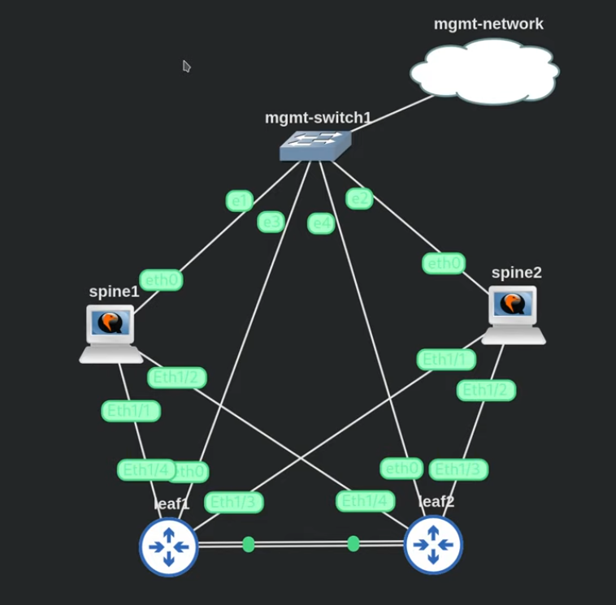

# Source Code for the Project

Find the CI/CD PoC source code here.

This code has been tested on Manjaro Linux but has not been tested on MacOS or Windows.

To get up and running with this example code, follow these steps:

  * Clone this repo to your own machine
  * Create a new repo for running your CI/CD system
  * Copy the contents of the /src folder into your new repo, commit and push to a new GitHub repo you have created
  * Set up the integration between Drone and your Github account (if not already done)
  * Sync your Drone server (if you do not see your new repo) - Drone should automatically see your new project as there is a .drone.yml example file in the /src directory
  * Ensure your runner has access to your automation target (GNS3 or physical hardware) and that the environment is connected per the diagram (see below). If you're using GNS3 you can import the GNS3 project file to automatically set up the project in your GNS3 environment.
  * Modify the appropriate inventory files to match the IP addresses of your leaf and spine switches to your environment.

Once you have those pre-requisites in place you can proceed with testing out the code. Modify the VLAN ID and VNI number in the `sonic_api_calls.yaml` file and commit the changes, then push them to the GitHub repo. Drone should immediately see the changes to the code and run a new build. Click into the build within Drone server to see the status and log output from Ansible on the runner. You should see the runner complete the `ansible-playbook` run without issues and a new VLAN + VLAN -> VNI mapping + VRF on your leaf switches.

## Network Diagram

